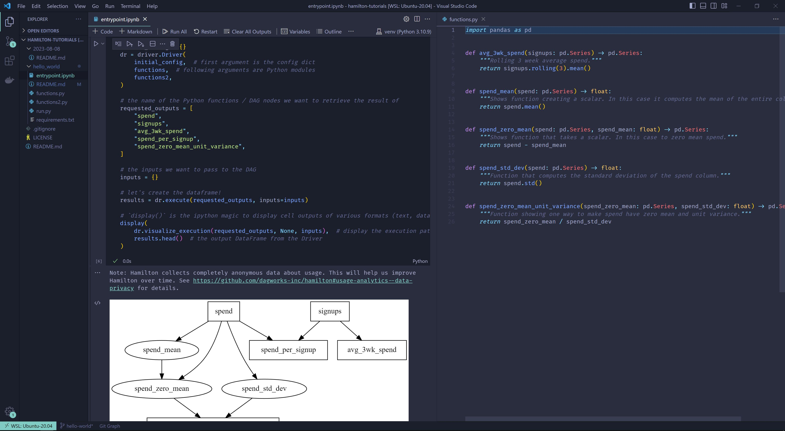
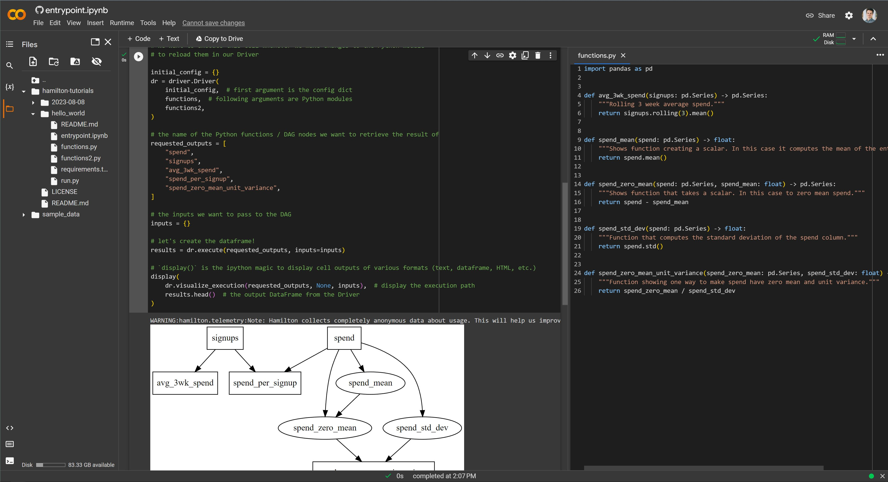

# Hello World

This directory illustrates the structure of examples found in this repository and introduces the basics to Hamilton. 

# Get started
## Local
1. Clone the repository `git clone https://github.com/dagworks-inc/hamilton-tutorials.git`
2. Move to this directory `cd hamilton-tutorials/hello_world`
3. Create a virtual environment `python -m venv ./venv`
4. Activate the virtual enviroment `. venv/bin/activate` (Linux, MacOS) or `. venv/bin/Scripts` (Windows)
5. Install requirements `pip install -r requirements.txt`
6. Go to `entrypoint.ipynb` and follow the notebook

## Google Colab
1. Go to https://colab.research.google.com/github/dagworks-inc/hamilton-tutorials/
2. Under `Repository` select `DAGWorks-Inc/hamilton-tutorials` with branch `main`
3. Under `Path` all the existing notebooks should appear. Select `hello_world/entrypoint.ipynb`
4. Follow the notebook

# Suggested workflow
We highly suggest to open the notebook and a text editor side-by-side. This enables writing functions in a Python module and automatically reloading them in your notebook (more on that in the notebook). If you didn't know, you can access a text editor in Google Colab if you double click on a .py file in the file explorer.

### VSCode

### Google Colab
